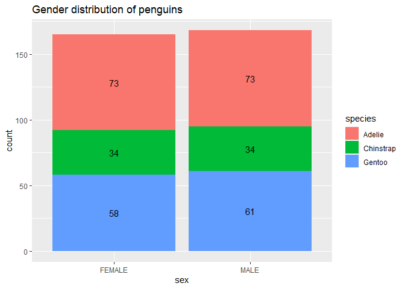
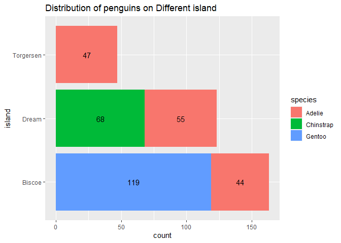
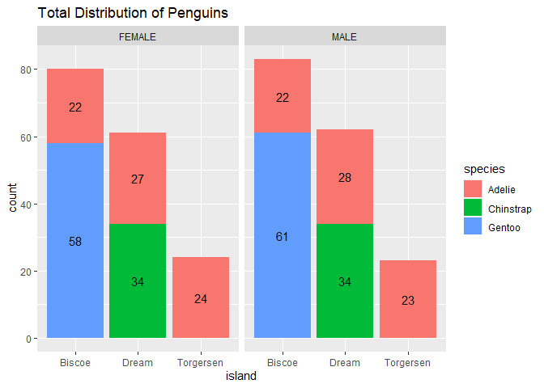
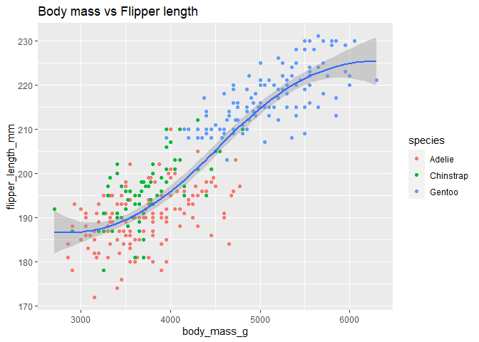

Palmer Penguins Project
================
Rania Shaikh
29/03/2022

## Introduction:

This particular data set is imported from kaggle [Palmer Archipelago
(Antarctica) penguin
data](https://www.kaggle.com/datasets/parulpandey/palmer-archipelago-antarctica-penguin-data)

## About the data set

Data were collected and made available by Dr. Kristen Gorman and the
Palmer Station, Antarctica LTER, a member of the Long Term Ecological
Research Network.

## License & citation

Data are available by CC-0 license in accordance with the Palmer Station
LTER Data Policy and the LTER Data Access Policy for Type I data.

## Phases of data analysis

The data will be analysed in phases which are as follows:

1.  Ask
2.  Prepare
3.  Process
4.  Analyze
5.  Share
6.  Act

## Ask

The analysis of Palmer Penguins data set will help us to answer the
following questions:

1.  Viewing Stats of the individual species.
2.  Male and females penguins of each species present in the data.
3.  Penguins species present on different island.
4.  Correlation coefficient -
    1.  flipper length and body mass
    2.  culmen length and culmen depth for each species.

## Prepare

This phase will helps us to get an idea about the data

### Loading packages

``` r
library(tidyverse)
```

    ## -- Attaching packages --------------------------------------- tidyverse 1.3.1 --

    ## v ggplot2 3.3.5     v purrr   0.3.4
    ## v tibble  3.1.6     v dplyr   1.0.8
    ## v tidyr   1.2.0     v stringr 1.4.0
    ## v readr   2.1.1     v forcats 0.5.1

    ## -- Conflicts ------------------------------------------ tidyverse_conflicts() --
    ## x dplyr::filter() masks stats::filter()
    ## x dplyr::lag()    masks stats::lag()

### Loading Data

``` r
penguins_size <- read.csv("~/palmer_penguins/penguins_size.csv")
head(penguins_size)
```

    ##   species    island culmen_length_mm culmen_depth_mm flipper_length_mm
    ## 1  Adelie Torgersen             39.1            18.7               181
    ## 2  Adelie Torgersen             39.5            17.4               186
    ## 3  Adelie Torgersen             40.3            18.0               195
    ## 4  Adelie Torgersen               NA              NA                NA
    ## 5  Adelie Torgersen             36.7            19.3               193
    ## 6  Adelie Torgersen             39.3            20.6               190
    ##   body_mass_g    sex
    ## 1        3750   MALE
    ## 2        3800 FEMALE
    ## 3        3250 FEMALE
    ## 4          NA   <NA>
    ## 5        3450 FEMALE
    ## 6        3650   MALE

``` r
glimpse(penguins_size)
```

    ## Rows: 344
    ## Columns: 7
    ## $ species           <chr> "Adelie", "Adelie", "Adelie", "Adelie", "Adelie", "A~
    ## $ island            <chr> "Torgersen", "Torgersen", "Torgersen", "Torgersen", ~
    ## $ culmen_length_mm  <dbl> 39.1, 39.5, 40.3, NA, 36.7, 39.3, 38.9, 39.2, 34.1, ~
    ## $ culmen_depth_mm   <dbl> 18.7, 17.4, 18.0, NA, 19.3, 20.6, 17.8, 19.6, 18.1, ~
    ## $ flipper_length_mm <int> 181, 186, 195, NA, 193, 190, 181, 195, 193, 190, 186~
    ## $ body_mass_g       <int> 3750, 3800, 3250, NA, 3450, 3650, 3625, 4675, 3475, ~
    ## $ sex               <chr> "MALE", "FEMALE", "FEMALE", NA, "FEMALE", "MALE", "F~

## Process

This phase deals with cleaning missing values, removing duplicates and
errors.

### Removing NA vlues

``` r
penguins_size <- penguins_size %>% filter(!is.na(culmen_length_mm), !is.na(culmen_depth_mm),!is.na(flipper_length_mm), !is.na(sex))
```

### Removing duplicates

``` r
sum(duplicated(penguins_size))
```

    ## [1] 0

There is no duplicate values in this data set.

### Removing errors

``` r
penguins_size <- penguins_size %>% filter(sex !='.')
```

### Total Number of Penguins in this data set

``` r
n_distinct(penguins_size)
```

    ## [1] 333

There are 333 penguins in this data set.

## Analyze

This phase involves observing the stats of the data

-   The total number of penguin species in the data set:

``` r
penguins_size %>% count(species)
```

    ##     species   n
    ## 1    Adelie 146
    ## 2 Chinstrap  68
    ## 3    Gentoo 119

-   There are 146 Adelie Penguins, 68 Chinstrap and 119 Gentoo penguin
    species.

### Summary of data based on species and Gender

-   For Adelie species male :

``` r
penguins_adele <- penguins_size %>% filter(species == 'Adelie')
penguins_adele_male <- penguins_adele %>% filter(sex=='MALE')
penguins_adele_male %>% 
  select(body_mass_g,flipper_length_mm,culmen_length_mm,culmen_depth_mm)%>%
  summary()
```

    ##   body_mass_g   flipper_length_mm culmen_length_mm culmen_depth_mm
    ##  Min.   :3325   Min.   :178.0     Min.   :34.60    Min.   :17.00  
    ##  1st Qu.:3800   1st Qu.:189.0     1st Qu.:39.00    1st Qu.:18.50  
    ##  Median :4000   Median :193.0     Median :40.60    Median :18.90  
    ##  Mean   :4043   Mean   :192.4     Mean   :40.39    Mean   :19.07  
    ##  3rd Qu.:4300   3rd Qu.:197.0     3rd Qu.:41.50    3rd Qu.:19.60  
    ##  Max.   :4775   Max.   :210.0     Max.   :46.00    Max.   :21.50

The following table describes that:

1.  Adelie male penguins have a body mass of around 4043 grams.
2.  Flipper length of around 192.4 mm.
3.  Culmen length of around 40.39 mm.
4.  Culmen depth of around 19.07 mm.

-   For Adelie female species

``` r
penguins_adele_female <-penguins_adele %>% filter(sex=='FEMALE')
penguins_adele_female%>% 
  select(body_mass_g,flipper_length_mm,culmen_length_mm,culmen_depth_mm)%>%
  summary()
```

    ##   body_mass_g   flipper_length_mm culmen_length_mm culmen_depth_mm
    ##  Min.   :2850   Min.   :172.0     Min.   :32.10    Min.   :15.50  
    ##  1st Qu.:3175   1st Qu.:185.0     1st Qu.:35.90    1st Qu.:17.00  
    ##  Median :3400   Median :188.0     Median :37.00    Median :17.60  
    ##  Mean   :3369   Mean   :187.8     Mean   :37.26    Mean   :17.62  
    ##  3rd Qu.:3550   3rd Qu.:191.0     3rd Qu.:38.80    3rd Qu.:18.30  
    ##  Max.   :3900   Max.   :202.0     Max.   :42.20    Max.   :20.70

The following table describes that:

1.  Adelie female penguins have a body mass of around 3369 grams.
2.  Flipper length of around 187.8 mm.
3.  Culmen length of around 37.26 mm.
4.  Culmen depth of around 17.62 mm.

-   For Chinstrap species male:

``` r
penguins_chins <- penguins_size %>% filter(species == 'Chinstrap')
penguins_chins_male <- penguins_chins %>% filter(sex == 'MALE')
penguins_chins_male%>% 
  select(body_mass_g,flipper_length_mm,culmen_length_mm,culmen_depth_mm)%>%
  summary()
```

    ##   body_mass_g   flipper_length_mm culmen_length_mm culmen_depth_mm
    ##  Min.   :3250   Min.   :187.0     Min.   :48.50    Min.   :17.50  
    ##  1st Qu.:3731   1st Qu.:196.0     1st Qu.:50.05    1st Qu.:18.80  
    ##  Median :3950   Median :200.5     Median :50.95    Median :19.30  
    ##  Mean   :3939   Mean   :199.9     Mean   :51.09    Mean   :19.25  
    ##  3rd Qu.:4100   3rd Qu.:203.0     3rd Qu.:51.98    3rd Qu.:19.80  
    ##  Max.   :4800   Max.   :212.0     Max.   :55.80    Max.   :20.80

The following table describes that:

1.  Chinstrap male penguins have a body mass of around 3939 grams.
2.  Flipper length of around 199.9 mm.
3.  Culmen length of around 51 mm.
4.  Culmen depth of around 19.25 mm.

-For Chinstrap Female:

``` r
penguins_chins_female <- penguins_chins %>% filter(sex == 'FEMALE')
penguins_chins_female%>% 
  select(body_mass_g,flipper_length_mm,culmen_length_mm,culmen_depth_mm)%>%
  summary()
```

    ##   body_mass_g   flipper_length_mm culmen_length_mm culmen_depth_mm
    ##  Min.   :2700   Min.   :178.0     Min.   :40.90    Min.   :16.40  
    ##  1st Qu.:3362   1st Qu.:187.2     1st Qu.:45.42    1st Qu.:17.00  
    ##  Median :3550   Median :192.0     Median :46.30    Median :17.65  
    ##  Mean   :3527   Mean   :191.7     Mean   :46.57    Mean   :17.59  
    ##  3rd Qu.:3694   3rd Qu.:195.8     3rd Qu.:47.38    3rd Qu.:18.05  
    ##  Max.   :4150   Max.   :202.0     Max.   :58.00    Max.   :19.40

The following table describes that:

1.  Chinstarp female penguins have a body mass of around 3527 grams.
2.  Flipper length of around 191.7 mm.
3.  Culmen length of around 46.57 mm..
4.  Culmen depth of around 17.6 mm.

-   For Gentoo male species:

``` r
penguins_gen <- penguins_size %>% filter(species =='Gentoo')
penguins_gen_male <- penguins_gen %>% filter(sex =='MALE')
penguins_gen_male %>% 
  select(body_mass_g,flipper_length_mm,culmen_length_mm,culmen_depth_mm)%>%
  summary()
```

    ##   body_mass_g   flipper_length_mm culmen_length_mm culmen_depth_mm
    ##  Min.   :4750   Min.   :208.0     Min.   :44.40    Min.   :14.10  
    ##  1st Qu.:5300   1st Qu.:218.0     1st Qu.:48.10    1st Qu.:15.20  
    ##  Median :5500   Median :221.0     Median :49.50    Median :15.70  
    ##  Mean   :5485   Mean   :221.5     Mean   :49.47    Mean   :15.72  
    ##  3rd Qu.:5700   3rd Qu.:225.0     3rd Qu.:50.50    3rd Qu.:16.10  
    ##  Max.   :6300   Max.   :231.0     Max.   :59.60    Max.   :17.30

The following table describes that:

1.  Gentoo male penguins have a body mass of around 5485 grams.
2.  Flipper length of around 221 mm.
3.  Culmen length of around 49.47 mm.
4.  Culmen depth of around 15.72 mm.

-   For Gentoo Female species:

``` r
penguins_gen_female <- penguins_gen %>% filter(sex=='FEMALE') 
penguins_gen_female%>% 
  select(body_mass_g,flipper_length_mm,culmen_length_mm,culmen_depth_mm)%>%
  summary()
```

    ##   body_mass_g   flipper_length_mm culmen_length_mm culmen_depth_mm
    ##  Min.   :3950   Min.   :203.0     Min.   :40.90    Min.   :13.10  
    ##  1st Qu.:4462   1st Qu.:210.0     1st Qu.:43.85    1st Qu.:13.80  
    ##  Median :4700   Median :212.0     Median :45.50    Median :14.25  
    ##  Mean   :4680   Mean   :212.7     Mean   :45.56    Mean   :14.24  
    ##  3rd Qu.:4875   3rd Qu.:215.0     3rd Qu.:46.88    3rd Qu.:14.60  
    ##  Max.   :5200   Max.   :222.0     Max.   :50.50    Max.   :15.50

The following table describes that:

1.  Gentoo female penguins have a body mass of around 4680 grams.
2.  Flipper length of around 212.7 mm.
3.  Culmen length of around 45.56 mm.
4.  Culmen depth of around 14.24 mm.

## Share

This phase involves answering questions with the help of plots

### Male and female penguins of each species present in the data.

``` r
ggplot(penguins_size,aes(x=sex ,fill=species))+
  geom_bar()+
  geom_text(aes(label=..count..),stat="count",position=position_stack(0.5))+
  labs(title = 'Gender distribution of penguins')
```

<!-- -->

### Penguins species present on different island.

``` r
ggplot(penguins_size, aes(x=island,fill=species))+ 
  geom_bar()+ 
  geom_text(aes(label=..count..),stat="count",position=position_stack(0.5))+
  coord_flip()+ labs(title= 'Distribution of penguins on Different island')
```

<!-- -->

### The above two question can be solved by this following plot:

``` r
ggplot(data=penguins_size,mapping=aes(x=island, fill=species))+
  geom_bar()+facet_wrap(~sex)+
  geom_text(aes(label=..count..),stat="count",position=position_stack(0.5))+
  labs(title = 'Total Distribution of Penguins')
```

<!-- -->

### Correlation Coefficient :

1.  Lets calculate the correlation coefficient for flipper_length and
    body_mass:

``` r
flipper_length <- penguins_size$flipper_length_mm
body_mass <- penguins_size$body_mass_g
cor(flipper_length,body_mass)
```

    ## [1] 0.8729789

The answer is close to 1 means there is a positive correlation between
the variables.

``` r
ggplot(data = penguins_size) +
  geom_point(mapping=aes(x=body_mass_g, y=flipper_length_mm, color = species))+
  geom_smooth(mapping =aes(x=body_mass_g, y=flipper_length_mm))+
                labs(title = 'Body mass vs Flipper length')
```

    ## `geom_smooth()` using method = 'loess' and formula 'y ~ x'

<!-- -->

2.  Calculating correlation coefficient between culmen depth and length:

``` r
culmen_length <- penguins_size$culmen_length_mm
culmen_depth <- penguins_size$culmen_depth_mm
cor(culmen_depth, culmen_length)
```

    ## [1] -0.2286256

There is no strong correlation coefficient between variables.

``` r
ggplot(data = penguins_size) +
  geom_point(mapping=aes(x=culmen_length_mm, y=culmen_depth_mm, color = species))+
  geom_smooth(mapping =aes(x=culmen_length_mm, y=culmen_depth_mm))+
                labs(title = 'Culmen depth vs Culmen length ')
```

    ## `geom_smooth()` using method = 'loess' and formula 'y ~ x'

<!-- -->

## Act

The summary and visuals from the above analysis shows that:

1.  Gentoo species are large sized penguins from the rest of the
    species.

2.  Adelie female penguins being small in size.

3.  There are more male penguins in the data set as compared to female
    penguins.

4.  Adelie penguins can be found on all three island according to data
    set.

5.  Where as Chinstrap Species are only found on Dream island and Gentoo
    species on Biscoe island.

6.  There is a positive correlation between flipper length and body mass
    which states that as body mass increases flipper length increases
    and vice-versa.

7.  There is as such no strong correlation seen between culmen length
    and depth.
